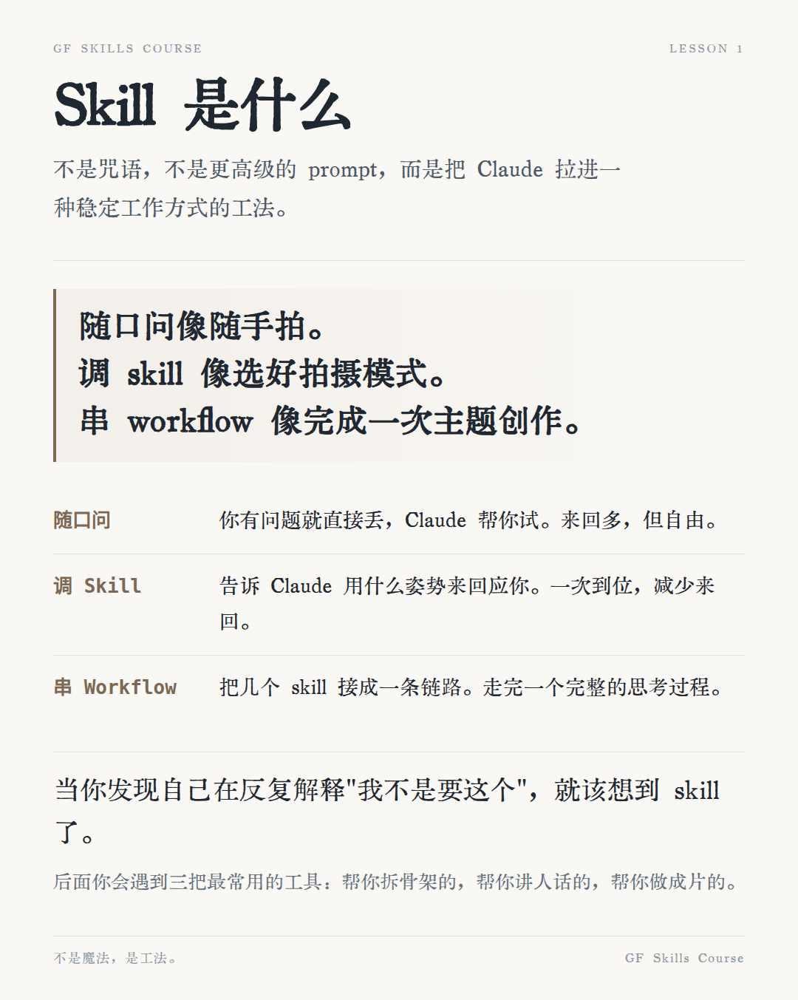

# 叽乖技能课 · 智能体从零到会用

<p align="center">
  
</p>

<p align="center">
  一套给零基础用户使用的「命令行里的智能体 + 技能卡片」交互式课程
</p>

<p align="center">
  <a href="https://xixiphus.github.io/GGuai_Skills_Tutorial/" target="_blank"><strong>🚀 在线预览</strong></a> •
  <a href="#课程大纲">课程大纲</a> •
  <a href="#快速开始">快速开始</a> •
  <a href="#项目结构">项目结构</a> •
  <a href="#功能特性">功能特性</a>
</p>

---

## 📚 课程大纲

本课程共包含 **8 节正式课程 + 1 节隐藏课程**，循序渐进带你掌握与 AI 智能体协作的核心技能：

| 课节  | 主题              | 内容概要                                        |
| :---: | :---------------- | :---------------------------------------------- |
|  01   | **Skill 初识**    | 理解什么是技能，如何与智能体协作                |
|  02   | **Prompt 五维**   | 开口成章：学习构建有效提示词的五个维度          |
|  03   | **Three Tools**   | 三刃初磨：掌握三种核心工具使用方法              |
|  04   | **Four Inputs**   | 因料施策：四种不同输入类型的处理策略            |
|  05   | **Writes 心法**   | 对影成文：让 AI 为你写出合适的内容              |
|  06   | **Card 成器**     | 铸图为证：将技能沉淀为可复用的卡片              |
|  07   | **Workflow 成链** | 三步成径：把技能串联成工作流                    |
|  08   | **Mastery 初成**  | 结课启程：综合运用，毕业项目准备                |
|   🎓   | **Capstone**      | 毕业项目：用所学真刀真枪做一件事                |
|   🔮   | **Wiring 洞见**   | 隐藏关卡：看见系统背后的布线（完成前8课后解锁） |

---

## 🚀 快速开始

### 环境要求

- Node.js 18+
- npm 或 yarn

### 安装依赖

```bash
npm install
```

### 开发模式

```bash
# 同时启动前端开发服务器和终端服务
npm run dev
```

访问 http://localhost:5173 即可开始学习。

### 构建生产版本

```bash
npm run build
```

构建产物将输出到 `dist/` 目录。

### 预览生产版本

```bash
npm run preview
```

---

## 🏗️ 项目结构

```
.
├── content/                  # 课程内容源文件
│   ├── 01-what-is-a-skill/   # 第1课：Skill 初识
│   ├── 02-ask-well/          # 第2课：Prompt 五维
│   ├── 03-first-three-skills/# 第3课：Three Tools
│   ├── ...
│   └── .behind-the-scenes/   # 课程制作幕后资料
├── src/                      # 前端源代码
│   ├── js/                   # JavaScript 模块
│   │   ├── navigation.js     # 课程导航逻辑
│   │   ├── progress.js       # 进度管理
│   │   ├── exercises.js      # 练习题系统
│   │   ├── kimi-grader.js    # AI 评卷功能
│   │   └── terminal.js       # 嵌入式终端
│   ├── lessons/              # 课程页面 HTML 模板
│   ├── styles/               # CSS 样式文件
│   └── data/                 # 课程结构配置
├── server/                   # 后端服务
│   └── terminal-server.js    # 终端 WebSocket 服务
├── scripts/                  # 构建与检查脚本
│   └── check-course-structure.mjs  # 课程结构校验
├── public/                   # 静态资源
├── index.html                # 主页面入口
└── vite.config.js            # Vite 配置文件
```

---

## ✨ 功能特性

### 📖 渐进式解锁
- 课程采用关卡解锁机制，完成前置课程才能进入下一课
- 第9课「Wiring 洞见」和 Capstone 为隐藏关卡，达成条件后自动解锁

### 💻 嵌入式终端
- 集成真实的终端模拟器（基于 xterm.js + node-pty）
- 支持在浏览器内直接执行命令，与智能体交互
- 可按 `Ctrl+\`` 快速切换终端面板

### 🤖 AI 智能评卷
- 支持配置 Kimi API Key
- 主观题由 AI 提供实时评分和多轮对话反馈
- 未配置 API Key 时显示静态参考答案

### 🎴 卡片收集系统
- 每完成一课，自动收集对应的技能卡片
- 卡片墙展示学习进度和成就

### 📱 响应式设计
- 支持桌面端和移动端访问
- 自适应侧边栏导航

---

## 📝 可用脚本

| 命令                   | 说明                               |
| :--------------------- | :--------------------------------- |
| `npm run dev`          | 同时启动 Vite 开发服务器和终端服务 |
| `npm run dev:vite`     | 仅启动前端开发服务器               |
| `npm run dev:terminal` | 仅启动终端 WebSocket 服务          |
| `npm run build`        | 构建生产版本                       |
| `npm run preview`      | 预览生产构建                       |
| `npm run teach`        | 构建并启动完整教学环境             |
| `npm test`             | 运行课程结构检查                   |
| `npm run check:course` | 检查课程内容完整性                 |

---

## 🔧 配置说明

### 配置 Kimi API（可选）

点击侧边栏底部的「⚙️ 配置 Kimi API」按钮，输入你的 API Key：

- API Key 仅存储在浏览器本地存储中
- 用于主观题的 AI 实时评卷和多轮对话
- 不配置不影响基础学习功能

### 局域网访问

开发服务器默认监听 `0.0.0.0`，局域网内其他设备可通过 `http://<本机IP>:5173` 访问。

---

## 🙏 致谢

本课程大量使用了 [ljg-skills](https://github.com/lijigang/ljg-skills) 的内容和方法论，感谢李继刚老师的优秀工作。

- **原仓库**: https://github.com/lijigang/ljg-skills
- **说明**: 本课程是基于 ljg-skills 方法论构建的交互式教学应用

## 📄 许可证

[Apache-2.0](LICENSE)

---
